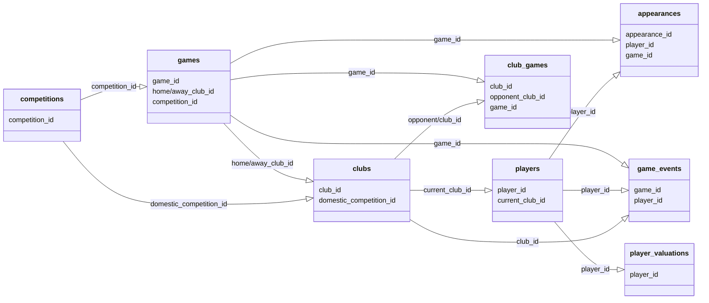

# transfermarkt-datasets

Clean, structured and **automatically updated** football (soccer) dataset built from [Transfermarkt](https://www.transfermarkt.co.uk/) data -- 68,000+ games, 30,000+ players, 1,500,000+ appearances and more, refreshed weekly.

## What's in it

The dataset is composed of **10 tables** covering competitions, games, clubs, players, appearances, player valuations, club games, game events, game lineups and transfers. Each table contains the attributes of the entity and IDs that can be used to join them together.

| Table | Description | Scale |
| --- | --- | --- |
| `competitions` | Leagues and tournaments | 40+ |
| `clubs` | Club details, squad size, market value | 400+ |
| `players` | Player profiles, positions, market values | 30,000+ |
| `games` | Match results, lineups, attendance | 68,000+ |
| `appearances` | One row per player per game played | 1,500,000+ |
| `player_valuations` | Historical market value records | 450,000+ |
| `club_games` | Per-club view of each game | 136,000+ |
| `game_events` | Goals, cards, substitutions | 950,000+ |
| `game_lineups` | Starting and bench lineups | 81,000+ |
| `transfers` | Player transfers between clubs | -- |

<a href="https://pub-e682421888d945d684bcae8890b0ec20.r2.dev/data/transfermarkt-datasets.zip"></a>
<a href="https://codespaces.new/dcaribou/transfermarkt-datasets/tree/master?quickstart=1"></a>
<a href="https://www.kaggle.com/datasets/davidcariboo/player-scores"></a>
<a href="https://data.world/dcereijo/player-scores"></a>

<details>
<summary><strong>ER diagram</strong></summary>



</details>

## Querying the data

Use any of the options above to get the data -- download the zip, grab it from Kaggle or data.world, or load individual tables into your tool of choice.

> **Pro-tip:** You can also query any table remotely with [DuckDB](https://duckdb.org/docs/installation/) -- no download required!

```sql
INSTALL httpfs; LOAD httpfs;

SELECT player_id, name, position, market_value_in_eur
FROM read_csv_auto('https://pub-e682421888d945d684bcae8890b0ec20.r2.dev/data/players.csv.gz')
WHERE position = 'Attack'
ORDER BY market_value_in_eur DESC
LIMIT 10;

-- player_id | name             | position | market_value_in_eur
-- 581678    | Florian Wirtz    | Attack   | 200000000
-- 342229    | Kylian Mbappe    | Attack   | 180000000
-- 418560    | Erling Haaland   | Attack   | 180000000
-- 401923    | Lamine Yamal     | Attack   | 150000000
-- ...
```

## Community

### Getting in touch
In order to keep things tidy, there are two simple guidelines
* Keep the conversation centralised and public by getting in touch via the [Discussions](https://github.com/dcaribou/transfermarkt-datasets/discussions) tab.
* Avoid topic duplication by having a quick look at the [FAQs](https://github.com/dcaribou/transfermarkt-datasets/discussions/175)

### Sponsoring
Maintenance of this project is made possible by <a href="https://github.com/sponsors/dcaribou">sponsors</a>. If you'd like to sponsor this project you can use the `Sponsor` button at the top.

## Contributing
Contributions to `transfermarkt-datasets` are most welcome. If you want to contribute new fields or assets to this dataset, the instructions are quite simple:
1. [Fork the repo](https://github.com/dcaribou/transfermarkt-datasets/fork)
2. Set up your [local environment](docs/developer-guide.md#setup)
3. [Populate the `data` directory](docs/developer-guide.md#data-storage)
4. Start modifying assets or creating new ones in [the dbt project](docs/developer-guide.md#data-preparation)
5. If it's all looking good, create a pull request with your changes :rocket:

> In case you face any issue following the instructions above please [get in touch](#getting-in-touch)

For full setup and workflow details, see the [Developer guide](docs/developer-guide.md).
