# transfermarkt-datasets

------

|  | 
|:--:| 
| *High level data model for transfermarkt-datasets* |

------

In an nutshell, this project aims for three things:

1. Acquire data from transfermarkt website using the [trasfermarkt-scraper](https://github.com/dcaribou/transfermarkt-scraper).
2. Build a **clean, public football (soccer) dataset** using data in 1.
3. Automatate 1 and 2 to **keep these assets up to date** and publicly available on some well-known data catalogs.

Checkout this dataset also in: :white_check_mark: [Kaggle](https://www.kaggle.com/davidcariboo/player-scores) | :white_check_mark: [data.world](https://data.world/dcereijo/player-scores) | 
:white_check_mark: [streamlit](https://transfermarkt-datasets.herokuapp.com/)

------

Continue on this `README` to learn about the different components of this project and how you can setup your environment for to run it locally.

- [setup](#setup)
- [data storage](#data-storage)
- [data acquisition](#data-acquisition)
- [data preparation](#data-preparation)
  - [dagster](#dagster)
  - [configuration](#configuration)
  - [python api](#python-api)
- [data publication](#data-publication)
- [streamlit 🎈](#streamlit-)
- [infra](#infra)
- [contributing :pray:](#contributing-pray)

------

## setup
Setup your local environment to run the project with `poetry`.
1. Install [poetry](https://python-poetry.org/docs/)
2. Clone the repo
```console
git clone --recursive git@github.com:dcaribou/transfermarkt-datasets.git
```
3. Install project dependencies in a virtual environment
```console
cd transfermarkt-datasets
poetry install
```

## data storage
> :information_source: Read access to the S3 [DVC remote storage](https://dvc.org/doc/command-reference/remote#description) for the project is required to successfully run `dvc pull`. Contributors can grant themselves access by adding their AWS IAM user ARN to [this whitelist](https://github.com/dcaribou/transfermarkt-datasets/blob/655fe130974905591ff80bb57813bedd01ec7d6c/infra/main.tf#L17).

All project data assets are kept inside the `data` folder. This is a [DVC](https://dvc.org/) repository and therefore all files can be pulled from the remote storage with the `dvc pull` command.

* `data/raw`: contains raw data per season as acquired with [trasfermarkt-scraper](https://github.com/dcaribou/transfermarkt-scraper) (check [acquire](#acquire))
* `data/prep`: contains prepared datasets as produced by `transfermarkt_datasets` module (check [prepare](#data-preparation))

## data acquisition
In the scope of this project, "acquiring" is the process of collecting "raw data", as it is produced by [trasfermarkt-scraper](https://github.com/dcaribou/transfermarkt-scraper). Acquired data lives in the `data/raw` folder and it can be created or updated for a particular season using the `1_acquire.py` script.

```console
python 1_acquire.py local --asset all --season 2022
```

This dependency on [trasfermarkt-scraper](https://github.com/dcaribou/transfermarkt-scraper) is the reason why it exists as a sub-module in this project. The `1_acquire.py` is simply a helper script that runs the scraper with a set of parameters and collects the output in `data/raw`.

## data preparation
In the scope of this project, "preparing" is the process of tranforming raw data to create a high quality dataset that can be conveniently consumed by analysts of all kinds. The `transfermark_datasets` module contains the preparation logic, which can be executed using the `2_prepare.py` script.

### dagster
The dataset preparation steps are rendered as a [dagster](https://dagster.io/) job and run either in `dagit` or with the `dagster` command.

```console
dagster job execute -f transfermarkt_datasets/dagster/jobs.py
```

In order to see and run the job from dagster UI
```console
dagit -f transfermarkt_datasets/dagster/jobs.py
```


### configuration
Different project configurations are defined in the [config.yml](config.yml) file.

### python api
`transfermark_datasets` provides a python api that can be used to work with the module from the python console. This is particularly convenient for working with the datasets from a notebook.

```python
# import the module
from transfermarkt_datasets.core.dataset import Dataset

# instantiate the datasets handler
td = Dataset()

# build the datasets from raw data
td.discover_assets()
td.build_datasets()
# if perpared files already exist in data/prep, you can just load them
# > td.load_assets()

# inspect the results
td.asset_names # ["games", "players", ...]
td.assets["games"].prep_df # get the built asset in a dataframe

# get raw data in a dataframe
td.assets["games"].load_raw()
td.assets["games"].raw_df 
```
For more examples on using `transfermark_datasets`, checkout the sample [notebooks](notebooks).

## data publication
Prepared data is published to a couple of popular dataset websites (Kaggle and data.world). This is done in the `3_sync.py` script.

## streamlit 🎈
There is a [streamlit](https://streamlit.io/) app for the project with documentation, a data catalog and sample analyisis. The app in hosted in Heroku, you can check it out [here](https://transfermarkt-datasets.herokuapp.com/).

For local development, you can also run the app in your machine. Provided you've done the [setup](#setup), run the following to spin up a local instance of the app
```console
make streamlit_local
```
> :warning: Note that the app expects prepared data to exist in `data/prep`. Check out [data storage](#data-storage) for instructions about how to populate that folder.

## [infra](infra)
Define all the necessary infrastructure for the project in the cloud with Terraform.

## contributing :pray:
Contributions to `transfermarkt-datasets` are most welcome. If you want to contribute new fields or assets to this dataset, instructions are quite simple:
1. [Fork the repo](https://github.com/dcaribou/transfermarkt-datasets/fork) (make sure to initialize sub-modules as well with `git submodule update --init --recursive`)
2. Set up a [local environment](##setup)
3. Pull the raw data by either running `dvc pull` ([requesting access is needed](#dvc)) or using the `1_acquire.py` script (no access request is needed)
4. Start modifying assets or creating a new one in `transfermarkt_datasets/assets`. You can use `2_prepare.py` to run and test your changes.
5. If it's all looking good, create a pull request with your changes :rocket:
