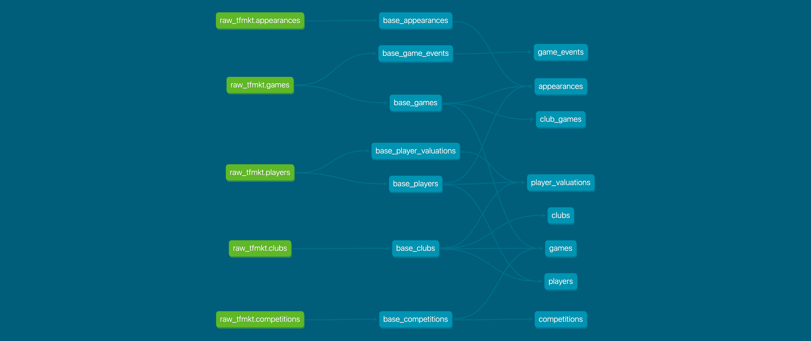

# transfermarkt-datasets

In an nutshell, this project aims for three things:

1. Acquiring data from the transfermarkt website using the [trasfermarkt-scraper](https://github.com/dcaribou/transfermarkt-scraper).
2. Building a **clean, public football (soccer) dataset** using data in 1.
3. Automating 1 and 2 to **keep these assets up to date** and publicly available on some well-known data catalogs.

[](https://transfermarkt-datasets.fly.dev/)
[](https://www.kaggle.com/datasets/davidcariboo/player-scores)
[](https://data.world/dcereijo/player-scores)

**🔈 New!** &rarr; Checkout [this sample notebook](notebooks/chat_playbook.ipynb) that demonstrating how to interact with the dataset using natural language leveraging OpenAI APIs.

------

------

- [setup](#setup)
  - [make](#make)
- [data storage](#data-storage)
- [data acquisition](#data-acquisition)
- [data preparation](#data-preparation)
  - [python api](#python-api)
- [data publication](#data-publication)
- [streamlit 🎈](#streamlit-)
- [infra](#infra)
- [contributing :pray:](#contributing-pray)

------

## setup
Setup your local environment to run the project with `poetry`.
1. Install [poetry](https://python-poetry.org/docs/)
2. Install python dependencies (poetry will create a virtual environment for you)
```console
cd transfermarkt-datasets
poetry install
```

### make
The `Makefile` in the root defines a set of useful targets that will help you run the different parts of the project. Some examples are
```console
dvc_pull                       pull data from the cloud (aws s3)
docker_build                   build the project docker image and tag accordingly
acquire_local                  run the acquiring process locally (refreshes data/raw)
prepare_local                  run the prep process locally (refreshes data/prep)
sync                           run the sync process (refreshes data frontends)
streamlit_local                run streamlit app locally
dagit_local                    run dagit locally
```
Run `make help` to see the full list. Once you've completed the setup, you should be able to run most of these from your machine.

## data storage
All project data assets are kept inside the `data` folder. This is a [DVC](https://dvc.org/) repository, so all files can be pulled from the remote storage with the `make dvc_pull`.

path | description
-|-
`data/raw` | contains raw data per season as acquired with [trasfermarkt-scraper](https://github.com/dcaribou/transfermarkt-scraper) (check [acquire](#data-acquisition))
`data/prep` | contains prepared datasets as produced by dbt (check [prepare](#data-preparation))

> :warning: Read access to the S3 [DVC remote storage](https://dvc.org/doc/command-reference/remote#description) for the project is required to successfully run `dvc pull`. Contributors can grant themselves access by adding their AWS IAM user ARN to [this whitelist](https://github.com/dcaribou/transfermarkt-datasets/blob/655fe130974905591ff80bb57813bedd01ec7d6c/infra/main.tf#L17).

## data acquisition
In the scope of this project, "acquiring" is the process of collecting "raw data", as it is produced by [trasfermarkt-scraper](https://github.com/dcaribou/transfermarkt-scraper). Acquired data lives in the `data/raw` folder and it can be created or updated for a particular season by running `make acquire_local`

```console
make acquire_local ARGS="--asset all --season 2022"
```
This runs the scraper with a set of parameters and collects the output in `data/raw`.

## data preparation
In the scope of this project, "preparing" is the process of transforming raw data to create a high quality dataset that can be conveniently consumed by analysts of all kinds.

Data prepartion is done in SQL using [dbt](https://docs.getdbt.com/) and [DuckDB](https://duckdb.org/). You can trigger a run of the preparation task using the `prepare_local` make target or work with the dbt CLI directly if you prefer.

* `cd dbt` &rarr; The [dbt](dbt) folder contains the dbt project for data preparation
* `dbt deps` &rarr; Install dbt packages. This is only required the first time you run dbt.
* `dbt run -m +appearances` &rarr; Refresh the appearances file by running the model in dbt.

dbt runs will populate a `dbt/duck.db` file in your local, which you can "connect to" using the DuckDB CLI and query the data using SQL.
```console
duckdb dbt/duck.db
```



### python api
A thin python wrapper is provided as a convenience utility to help with loading and inspecting the dataset (for example, from a notebook).

```python
# import the module
from transfermarkt_datasets.core.dataset import Dataset

# instantiate the datasets handler
td = Dataset()

# load all assets into memory as pandas dataframes
td.load_assets()

# inspect assets
td.asset_names # ["games", "players", ...]
td.assets["games"].prep_df # get the built asset in a dataframe

# get raw data in a dataframe
td.assets["games"].load_raw()
td.assets["games"].raw_df 
```

The module code lives in the `transfermark_datasets` folder with the structure below.

path | description
-|-
`transfermark_datasets/core` | core classes and utils that are used to work with the dataset.
`transfermark_datasets/tests` | unit tests for core classes.
`transfermark_datasets/assets` | perpared asset definitions: one python file per asset

For more examples on using `transfermark_datasets`, checkout the sample [notebooks](notebooks).

## data publication
Prepared data is published to a couple of popular dataset websites. This is done running `make sync`, which runs weekly as part of the [data pipeline](.github/workflows/on-schedule.yml).

* [Kaggle](https://www.kaggle.com/datasets/davidcariboo/player-scores)
* [data.world](https://data.world/dcereijo/player-scores)

## streamlit 🎈
There is a [streamlit](https://streamlit.io/) app for the project with documentation, a data catalog and sample analyisis. The app is currently hosted in fly.io, you can check it out [here](https://transfermarkt-datasets.fly.dev/).

For local development, you can also run the app in your machine. Provided you've done the [setup](#setup), run the following to spin up a local instance of the app
```console
make streamlit_local
```
> :warning: Note that the app expects prepared data to exist in `data/prep`. Check out [data storage](#data-storage) for instructions about how to populate that folder.

## [infra](infra)
Define all the necessary infrastructure for the project in the cloud with Terraform.

## contributing :pray:
Contributions to `transfermarkt-datasets` are most welcome. If you want to contribute new fields or assets to this dataset, the instructions are quite simple:
1. [Fork the repo](https://github.com/dcaribou/transfermarkt-datasets/fork)
2. Set up your [local environment](##setup)
3. Pull the raw data by either running `dvc pull` ([requesting access is needed](#data-storage)) or using `make acquire_local` script (no access request needed)
4. Start modifying assets or creating new ones in the dbt project. You can use `make prepare_local` to run and test your changes.
5. If it's all looking good, create a pull request with your changes :rocket:

> ℹ️ In case you face any issue following the instructions above or just if you have questions in general you may
> - check past [Issues](https://github.com/dcaribou/transfermarkt-datasets/issues?q=is%3Aissue) for similar problems or open a new one
> - check past [Discussions](https://github.com/dcaribou/transfermarkt-datasets/discussions) for similar problems or open a new one
