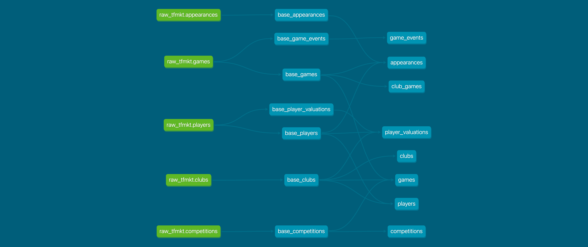

# Developer guide

## Setup

> Thanks to [Github codespaces](https://github.com/features/codespaces) you can spin up a working dev environment in your browser with just a click, **no local setup required**.
>
> [](https://codespaces.new/dcaribou/transfermarkt-datasets/tree/master?quickstart=1)

Set up your local environment with [poetry](https://python-poetry.org/docs/):

```console
cd transfermarkt-datasets
poetry install
poetry shell
```

This creates a virtual environment at `.venv/` and installs all dependencies.

### just

The `justfile` in the root defines a set of useful recipes. Some examples:

```console
dvc_pull                       pull data from the cloud
docker_build                   build the project docker image and tag accordingly
acquire_local                  run the acquiring process locally (refreshes data/raw/<acquirer>)
prepare_local                  run the prep process locally (refreshes data/prep)
sync                           run the sync process (refreshes data frontends)
streamlit_local                run streamlit app locally
```

Run `just --list` to see the full list.

## Data storage

All project data assets are kept inside the [`data`](../data) folder. This is a [DVC](https://dvc.org/) repository, so all files can be pulled from remote storage by running:

```console
dvc pull
```

Data is stored in [Cloudflare R2](https://developers.cloudflare.com/r2/) and served via a public URL, so no credentials are needed for pulling.

To **push** data to the remote, you need R2 credentials configured as per-remote DVC config:

```console
dvc remote modify --local r2 access_key_id <R2_ACCESS_KEY_ID>
dvc remote modify --local r2 secret_access_key <R2_SECRET_ACCESS_KEY>
```

This stores credentials in `.dvc/config.local` (gitignored).

| path        | description                                                                                         |
| ----------- | --------------------------------------------------------------------------------------------------- |
| `data/raw`  | Raw data from different acquirers (check [data acquisition](#data-acquisition) below)               |
| `data/prep` | Prepared datasets as produced by dbt (check [data preparation](#data-preparation))                  |

## Data acquisition

"Acquiring" is the process of collecting data from a specific source via an acquiring script. Acquired data lives in the `data/raw` folder.

### Acquirers

An acquirer is a script that collects data from somewhere and puts it in `data/raw`. They are defined in the [`scripts/acquiring`](../scripts/acquiring) folder and run using the `acquire_local` recipe. For example:

```console
just --set acquirer transfermarkt-api --set args "--season 2024" acquire_local
```

This populates `data/raw/transfermarkt-api` with the collected data. You can also run the script directly:

```console
cd scripts/acquiring && python transfermarkt-api.py --season 2024
```

### Adding or extending competitions

Which competitions are scraped is controlled by the `competition_ids` list in [`config.yml`](../config.yml). To add a competition, append its Transfermarkt competition ID (the last path segment of its URL, e.g. `GB1`) to that list.

**Competitions not in Transfermarkt's confederation hierarchy** (such as domestic play-offs) will never appear in the output of `tfmkt competitions`, even if their ID is in `config.yml`. For these, add a hand-crafted JSONL record to [`data/supplemental_competitions.json`](../data/supplemental_competitions.json). Records in that file are merged into `data/competitions.json` on every `acquire_local --asset competitions` run, so they survive re-acquisition. `data/competitions.json` itself is a generated file — do not edit it directly.

When crafting a supplemental record, match the shape of existing entries in `data/competitions.json` and set `competition_type` to a value that maps to the correct URL scheme in `tfmkt/common.py`:

| `competition_type`   | URL generated by the scraper                              |
|----------------------|-----------------------------------------------------------|
| `first_tier`         | `.../startseite/wettbewerb/{ID}/plus/0?saison_id={year}` |
| `domestic_cup` / `domestic_super_cup` | `.../startseite/pokalwettbewerb/{ID}?saison_id={year}` |
| anything else        | `.../startseite/wettbewerb/{ID}?saison_id={year}`        |

Play-offs and other non-standard competitions should use `play_off` (or any value not in the table above) to get the plain `wettbewerb` URL.

## Data preparation

"Preparing" is the process of transforming raw data into a high-quality dataset. This is done in SQL using [dbt](https://docs.getdbt.com/) and [DuckDB](https://duckdb.org/).

- `cd dbt` — the [dbt](../dbt) folder contains the dbt project
- `dbt deps` — install dbt packages (required the first time)
- `dbt run -m +appearances` — refresh assets by running the corresponding model

Or use the `prepare_local` recipe from the repo root:

```console
just prepare_local
```

dbt runs populate a `dbt/duck.db` file locally. Query it with Python (no DuckDB CLI required):

```console
python -c "import duckdb; print(duckdb.connect('dbt/duck.db').sql('SELECT * FROM dev.games LIMIT 10').fetchdf())"
```



## Frontends

Prepared data is published to popular dataset platforms by running `just sync`, which runs weekly as part of the data pipeline.

- [Kaggle](https://www.kaggle.com/datasets/davidcariboo/player-scores)
- [data.world](https://data.world/dcereijo/player-scores)

There is also a [streamlit](https://streamlit.io/) app with documentation, a data catalog, and sample analysis. Run it locally with:

```console
just streamlit_local
```

> Note: the app expects prepared data to exist in `data/prep`. Run `dvc pull` or `just prepare_local` first.

## Infra

All cloud infrastructure is defined as code using Terraform in the [`infra`](../infra) folder.

## Orchestration

The data pipeline is orchestrated as a series of Github Actions workflows defined in [`.github/workflows`](../.github/workflows).

| workflow name            | triggers on                                                  | description                                                                                                   |
| ------------------------ | ------------------------------------------------------------ | ------------------------------------------------------------------------------------------------------------- |
| `build`*                 | Every push to `master` or an open pull request               | Runs data preparation, tests, and commits a new version of the prepared data if there are changes             |
| `acquire-<acquirer>.yml` | Schedule                                                     | Runs the acquirer and commits acquired data to the corresponding raw location                                 |
| `sync-<frontend>.yml`    | Every change on prepared data                                | Syncs prepared data to the corresponding frontend                                                             |

*`build-contribution` is the same as `build` but without committing data.

> Debugging workflows remotely is a pain. Use [act](https://github.com/nektos/act) to run them locally where possible.
